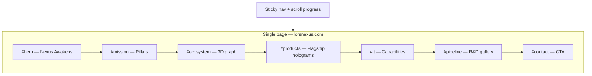

# LORS Nexus Website v2 — Product Requirements Document

**Document version:** 2.0 (consolidated — Cursor plan + stakeholder Q&A + chat PRD)  
**Last updated:** 2026-05-29  
**Canonical file:** `/Users/erkumardevender/.cursor/plans/lors_nexus_website_prd_6cf50c35.plan.md`  
**Repo mirror (recommended):** `docs/lorsnexus-website-prd.md` in RoutematesV2 (not yet copied)  
**Product:** [LORSWeb](/Users/erkumardevender/Desktop/RoutematesV2/LORSWeb/) → **lorsnexus.com**  
**Hosting:** Firebase Hosting — project **`lors-nexus`**, account **`lorsnexus@lorsnexus.com`**  
**Live v1:** https://lors-nexus.web.app  
**Timeline:** **Quality over speed** — phased exits, no fixed 12-week deadline  

---

## Revision history

| Version | Source | Changes |
|---------|--------|---------|
| 1.0 | Initial Cursor plan | Hybrid routes, 12-week roadmap, brand credibility, full rebrand |
| 2.0 | Stakeholder Q&A + deployment | **Single-page cinematic IA**, **product showcase** goal, **consumers + investors**, calm premium × enterprise tone, **Bruno Simon** interaction reference, **3D on mobile required**, markdown content, visual-first a11y, Firebase ops documented |

---

## Pass 1 — Foundation (current state + vision)

### 1.1 Executive summary

Rebuild **LORS Nexus** from a CSS-hologram single-page site into a **cinematic, scroll-driven 3D product showcase**: a persistent **nexus core** WebGL journey with **hybrid hologram product stages** (R3F meshes + evolved CSS scanline UI). The site must feel **futuristic, premium, and credible**—Bruno Simon–level craft, toned down for enterprise trust—not a generic dark SaaS template.

**Primary goal:** Drive understanding and interest in **RouteMates** (beta) and **Family OS** (coming soon) within the parent ecosystem narrative.

**North-star moment:** User scrolls; camera orbits a glowing nexus lattice; ecosystem nodes pulse; RouteMates and Family OS rise as **inspectable holographic artifacts**; investors grasp portfolio depth in ~90 seconds without leaving the page.

### 1.2 Current state audit (LORSWeb)

| Area | Today (v1 shipped) | Gap vs v2 |
|------|-------------------|-----------|
| Stack | Vite 5, React 18, Tailwind 3, TS | R3F/Three/GSAP not in `package.json` yet (add in Phase 1) |
| 3D | CSS `perspective` + `.hologram-card` in `src/styles/index.css` | No meshes, lights, scroll-linked camera |
| Motion | `useScrollReveal.ts` (IntersectionObserver, one-shot) | No master scroll timeline |
| Mobile 3D | **Disabled** at `max-width: 768px` (flat cards) | **Must enable real 3D** on mobile (LOD) |
| Content | `src/content.ts` hardcoded | Markdown/JSON in repo |
| IA | Single page: Hero → Mission → IT → Ecosystem → Products → Pipeline → Contact | **Keep single page**; deepen acts; optional Phase 3 overlays |
| Brand | Navy `#0a0f1c`, accent `#5b8def`, DM Sans + Inter | Evolve tokens (premium sci-fi × enterprise), not unrelated rebrand |
| Deploy | `firebase.json`, `.firebaserc` → `lors-nexus`, `npm run deploy` | Keep; enforce `lorsnexus@lorsnexus.com` |
| Node for CLI | Dev machine needed Node 20+ for `firebase-tools` | Document in README |

**Preserve:** Firebase deploy flow, `VITE_CONTACT_EMAIL` (default **`lorsnexus@lorsnexus.com`**), `VITE_ROUTEMATES_URL`, domain **lorsnexus.com** (DNS pending in Squarespace).

**Retire:** Accidental deploy under `erkumardevender@gmail.com` → project `lorsnexus-web` (delete when convenient).

### 1.3 Confirmed product decisions (stakeholder Q&A — authoritative)

| Decision | Choice |
|----------|--------|
| **Primary goal** | **Product showcase** — RouteMates & portfolio |
| **Audiences** | **Consumers** + **investors** (dual narrative on one scroll) |
| **Brand tone** | **Calm premium sci-fi** × **enterprise trustworthy** (~80% restraint, ~20% Bruno Simon playfulness) |
| **Reference** | **Bruno Simon** — skillful WebGL, memorable motion (not full game UI) |
| **Structure** | **Single long-scroll page** with anchor nav (`#mission`, `#products`, …) |
| **3D stack** | **Hybrid** — R3F + drei + postprocessing; CSS hologram overlays on cards |
| **Scroll** | **Cinematic** — master timeline drives camera, fog, particles |
| **Devices** | **3D on desktop and mobile** (tiered quality, not flat-only mobile) |
| **Content** | **Markdown/JSON in repo** → build-time generation |
| **Language** | **English only** v1 |
| **Timeline** | **No fixed rush** — phase gates, ship slices to Firebase |
| **Accessibility** | **Visual-first v1**; ship reduced-motion → Fallback tier + keyboard CTAs |
| **RouteMates CTA** | Env `VITE_ROUTEMATES_URL` when ready; no Play Store badge until live |
| **Contact email** | **`lorsnexus@lorsnexus.com`** — mailto CTAs (hero, contact, footer) via `VITE_CONTACT_EMAIL` |
| **SEO / legal** | SEO + OG in Phase 3; Privacy/Terms optional Phase 3 |

### 1.4 Out of scope for v1 (was incorrectly in v1.0 plan)

- **Multi-route SPA** (`react-router` product pages) — deferred; use scroll acts + optional modals in Phase 3  
- **Enterprise IT / developers** as primary personas — secondary in copy only  
- **Full WCAG 2.2 AA** program  
- **17-language i18n** (align with Routemates Android later)  
- **Headless CMS** — markdown in repo first  

### 1.5 Product principles

1. **Showcase over spectacle** — Motion sells products and ecosystem, not demo reel noise.  
2. **Hybrid immersion** — WebGL where it matters; CSS hologram UI for readable, selectable text.  
3. **Mobile is first-class** — Real 3D with LOD; never “mobile = flat only.”  
4. **Content-owned** — Edit markdown without touching R3F shaders.  
5. **Progressive quality** — Ultra / Standard / Fallback tiers + `prefers-reduced-motion`.  
6. **Ship in slices** — Each phase deploys to `lors-nexus`; preview channel optional.

### 1.6 Dual narrative (one scroll, two readers)

| Scroll act | Consumer story | Investor story |
|------------|----------------|----------------|
| Hero | “Elevating everyday experiences” | Category + brand scale |
| Mission | Real daily problems | Execution discipline |
| Ecosystem 3D | Products orbit nexus | Portfolio / spin-out model |
| Flagships | Try RouteMates; Family OS soon | Beta signal + roadmap |
| IT | Engineering trust | Platform + consulting optionality |
| Pipeline | Exciting utilities coming | R&D breadth |
| Contact | Get in touch | Partnership / diligence |

---

## Pass 2 — Experience architecture (IA, design, 3D system)

### 2.1 Information architecture (single page)



**Optional Phase 3 (not v1 blocker):** Product detail **modal** from hologram tap; footer links to `/privacy`, `/terms` if legal routes added.

**Global chrome:** Sticky nav (glass), scroll progress / act dots, skip link, optional mute (if audio in Phase 3).

### 2.2 Scroll acts (cinematic timeline)

| Act | Anchor | Scroll % (tune in design) | 3D / motion |
|-----|--------|---------------------------|-------------|
| 0 | — | Loader gate optional | Branded progress < 3s |
| 1 | `#hero` | 0–15% | Nexus core idle + particles; headline on glass slab |
| 2 | `#mission` | 15–30% | Three holographic pillars materialize |
| 3 | `#ecosystem` | 30–45% | **3D constellation** replaces SVG `EcosystemSection` |
| 4 | `#products` | 45–60% | RouteMates + Family OS pedestals; pin ~1 viewport each |
| 5 | `#it` | 60–75% | Cleaner grid plane; floating capability nodes |
| 6 | `#pipeline` | 75–88% | 3D card belt or depth carousel |
| 7 | `#contact` | 88–100% | Camera pulls back; bloom down; mailto CTA dominant |

**Binding:** One normalized scroll progress `0..1` drives camera `position`, `lookAt`, fog, particle speed. **Reversible** on scroll up. Max **2 pinned sections** per page.

### 2.3 Brand & visual direction

**Tone:** Premium command center — deep space navy/violet, soft cyan/magenta hologram accents, restrained bloom.

| Token | v1 today | v2 direction |
|-------|----------|--------------|
| Background | Flat gradients | Volumetric fog + subtle starfield |
| Display type | DM Sans | Keep or upgrade (Space Grotesk / Outfit) after brand lock |
| Body | Inter | Inter or Geist |
| Hologram | CSS gradient border | Fresnel rim (WebGL) + scanlines/shimmer (CSS) |
| Motion | Bounce chevron | GSAP ScrollTrigger; gyro parallax on mobile where safe |

**Anti-patterns:** neon overload, illegible text on busy GLB, scroll-jacking, >2MB hero GLB, autoplay sound.

### 2.4 3D & animation technical architecture

**Libraries (add in Phase 1):**

| Package | Role |
|---------|------|
| `@react-three/fiber` | React renderer |
| `@react-three/drei` | Environment, ScrollControls, Float, `Html` overlays |
| `three` | WebGL |
| `@react-three/postprocessing` | Bloom, vignette (Ultra tier only) |
| `gsap` + `ScrollTrigger` | Cinematic scroll sync |
| `zustand` | Quality tier, active act, reduced motion |
| `gray-matter` | Markdown frontmatter |

**No `react-router-dom` in v1.**

**Proposed `src/` layout:**

```
src/
  experience/
    CanvasRoot.tsx
    scenes/
      HeroScene.tsx
      EcosystemScene.tsx
      ProductPedestalScene.tsx
    materials/
    hooks/
      useScrollProgress.ts
      useQualityTier.ts
  components/          # existing + ui/
  content/             # or repo-root content/
  generated/           # build output from markdown
  lib/content.ts
```

**Hologram cards:** Evolve `ProjectHologramCard.tsx` → R3F pedestal mesh + `<Html>` for SEO-friendly text + CSS scanlines.

### 2.5 Mobile 3D strategy (required)

| Technique | Desktop (Ultra) | Mobile (Standard) |
|-----------|-----------------|-------------------|
| Visible tris | ≤ 150k | ≤ 40k |
| Textures | 2K max | 1K / atlas |
| Post-FX | Bloom + light SSAO | Bloom reduced or off |
| DPR cap | `min(dpr, 2)` | `min(dpr, 1.5)` |
| Interactions | Mouse parallax | Touch “inspect” 360° on flagship |
| FPS guard | If < 24fps 2s → step down | Same |

**Fallback tier:** WebGL fail / `prefers-reduced-motion` → static hero poster + CSS parallax; **all CTAs work**.

### 2.6 Bruno Simon–inspired interactions (scoped)

- Cursor parallax on desktop (hero, ecosystem)  
- Optional device orientation parallax on mobile (no permission if unavailable)  
- Subtle physics on hover (flagship cards)  
- **Not in scope:** drivable world, game controls, full-screen mini-game  

### 2.7 Content model (markdown in repo)

```
LORSWeb/content/
  site.yaml
  mission.md
  it-capabilities.md
  products/
    routemates.md
    family-os.md
  pipeline/
    tripkit.md
    docvault.md
    twincam.md
    nexus-lab.md
legal/                    # Phase 3
  privacy.md
  terms.md
```

**Product frontmatter example:**

```yaml
id: routemates
name: RouteMates
status: beta
category: travel
featured: true
href_env: VITE_ROUTEMATES_URL
glb: assets/models/routemates.glb   # optional Phase 2
notifyCta: false
```

**Build:** `scripts/build-content.mjs` → `src/generated/content.json` + types.

### 2.8 SEO, analytics, legal (Phase 3)

- Single-page meta + OG image (1200×630); JSON-LD `Organization`, `SoftwareApplication` for RouteMates  
- `sitemap.xml` (single URL + anchors optional)  
- Analytics: Plausible or GA4 via `VITE_ANALYTICS_ID`  
- Events: `cta_contact`, `scroll_depth_50`, `scroll_depth_100`, `product_hologram_focus`  
- Legal pages from markdown if required  

---

## Pass 3 — Delivery, quality bar, acceptance

### 3.1 Phased roadmap (quality over speed)

**Phase 0 — Foundation**  
- Brand token evolution (palette, type, logo SVG)  
- Markdown pipeline + migrate `content.ts`  
- Design system shell; static home with new tokens (no WebGL)  
- **Exit:** Deploy to Firebase preview; copy editable via markdown  

**Phase 1 — WebGL core**  
- R3F canvas + scroll timeline (GSAP)  
- Hero nexus + ecosystem 3D graph  
- `useQualityTier()` + Fallback path  
- **Mobile 3D Standard tier** (replace CSS-only mobile disable)  
- **Exit:** Cinematic home on desktop + mobile; https://lors-nexus.web.app updated  

**Phase 2 — Product showcase**  
- Hybrid hologram stages for RouteMates & Family OS  
- Pipeline 3D gallery; IT section motion refresh  
- Bruno Simon micro-interactions  
- Android coming-soon CTA (no store badge)  
- **Exit:** Product showcase story complete on single page  

**Phase 3 — Launch polish**  
- Postprocessing pass (Ultra only)  
- SEO/OG, optional legal, analytics  
- Perf pass; custom domain **lorsnexus.com** (Squarespace DNS)  
- **Exit:** Production launch on lorsnexus.com  

*Durations are team-dependent; do not block Phase 2 on perfect postprocessing.*

### 3.2 Non-functional requirements

| Metric | Target |
|--------|--------|
| LCP (Fallback tier) | < 2.5s on 4G |
| WebGL init (Standard) | < 3s |
| Mobile FPS | ≥ 30fps target on iPhone 12-class / mid Android |
| JS budget | Monitor `three` chunk; code-split experience bundle |
| i18n | English v1 only |
| Deploy account | **`lorsnexus@lorsnexus.com` only** (`scripts/deploy-firebase.sh`) |
| Node for Firebase CLI | ≥ 20 (`/opt/homebrew/opt/node@20/bin`) |

### 3.3 Accessibility (visual-first v1 — minimum bar)

- `prefers-reduced-motion` → Fallback tier automatically  
- Keyboard-focusable CTAs; visible focus rings  
- Skip link: “Skip to content”  
- Decorative canvas `aria-hidden`; product copy in DOM  
- **Not required v1:** full screen reader path through 3D scene  

### 3.4 Key user stories

1. **Consumer** on Android scrolls flagships, understands RouteMates beta, finds CTA without jank.  
2. **Investor** scrolls 90s, names 3+ products and parent/ecosystem model.  
3. **Maintainer** edits `content/products/routemates.md`, rebuilds, deploys—no shader change.  
4. **Visitor** without WebGL sees readable site and working mailto.  

### 3.5 Acceptance criteria (launch checklist)

- [ ] https://lors-nexus.web.app serves v2 (then https://lorsnexus.com)  
- [ ] Active Firebase CLI account is `lorsnexus@lorsnexus.com`  
- [ ] Cinematic scroll runs on Ultra tier without console errors  
- [ ] **Mobile shows 3D** on Standard tier (not flat-only breakpoint)  
- [ ] Fallback tier works; reduced-motion respected  
- [ ] Single-page anchors and nav work; deep link `#products` seeks timeline  
- [ ] Markdown content drives copy; `content.ts` retired or generated  
- [ ] RouteMates: no broken store link; env URL or coming-soon  
- [ ] Contact mailto uses `lorsnexus@lorsnexus.com` (`VITE_CONTACT_EMAIL`)  
- [ ] OG preview correct (Phase 3)  

### 3.6 Risks and mitigations

| Risk | Mitigation |
|------|------------|
| Mobile 3D battery/heat | LOD, FPS cap, pause when tab hidden |
| Bruno Simon scope creep | Pin interactions to marketing beats |
| Cinematic scroll fatigue | Max 2 pins; ~8–12 viewport heights total |
| Wrong Firebase account | `deploy-firebase.sh` + `login:list` check |
| SEO vs canvas | DOM `Html` overlays; prerender evaluate Phase 3 |
| Solo maintainer | Strict scene / content split |

### 3.7 Out of scope (v2.0)

- Multi-route product pages (v1)  
- Play Store / App Store badges until published  
- Authenticated CMS  
- Blog / newsroom  
- i18n beyond English  
- Firebase Auth on marketing site  
- Family OS public download  

### 3.8 Success metrics (90 days post-launch)

- Scroll depth > 50% median  
- Clicks on RouteMates CTA / contact mailto vs v1 baseline  
- Qualitative: “premium / credible” from investors; “clear what RouteMates is” from consumers  
- Bounce rate < 55% (if analytics enabled)  

---

## Appendix A — v1 → v2 component map

| v1 file | v2 role |
|---------|---------|
| `Hero.tsx` | `HeroAct` + `HeroScene` (R3F) |
| `EcosystemSection.tsx` | `EcosystemAct` + `NexusGraph3D` |
| `ProjectHologramCard.tsx` | `ProductHologramStage` (hybrid) |
| `useScrollReveal.ts` | Superseded by scroll timeline controller |
| `content.ts` | Generated from `content/**/*.md` |
| `styles/index.css` | Tokens + hologram v2 utilities |

## Appendix B — Firebase & ops (current)

| Item | Value |
|------|--------|
| Project ID | `lors-nexus` |
| Account | `lorsnexus@lorsnexus.com` |
| Hosting URL | https://lors-nexus.web.app |
| Deploy | `cd LORSWeb && npm run deploy` |
| `.firebaserc` | `default: lors-nexus` |
| Wrong account artifact | `lorsnexus-web` @ `erkumardevender@gmail.com` — delete optional |
| Custom domain | Firebase Hosting → Squarespace DNS (pending) |
| Local preview | `npm run preview` → localhost:4173 (builds first) |
| Contact email | `lorsnexus@lorsnexus.com` (`VITE_CONTACT_EMAIL`) |

## Appendix C — Open items (resolve before / during Phase 2)

1. RouteMates CTA at launch: app URL vs mailto waitlist only?  
2. Family OS CTA: mailto waitlist vs form?  
3. 3D assets: custom Blender GLB vs procedural/code-only geometry?  
4. Budget for 3D designer vs in-house?  
5. Investor one-pager PDF in footer?  
6. Subtle background audio (default off)?  
7. Prerender for SEO (Phase 3 evaluation)?  
8. Copy `docs/lorsnexus-website-prd.md` into repo for team visibility?  

## Appendix D — Plan todos (execution tracker)

| ID | Phase | Status |
|----|-------|--------|
| `brand-lock` | 0 | pending |
| `repo-foundation` | 0 | pending |
| `r3f-scroll-core` | 1 | pending |
| `immersive-sections` | 2 | pending |
| `launch-polish` | 3 | pending |

---

*PRD v2.0 merges three refinement passes plus stakeholder Q&A (2026-05). Supersedes v1.0 hybrid-route and 12-week assumptions where they conflict.*
